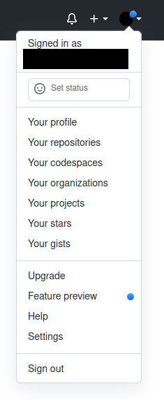
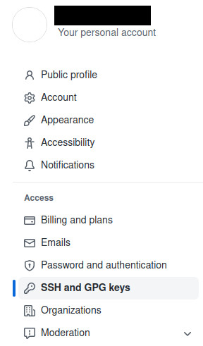

# Laptop workstation setup

- Instructions for Ubuntu 20

## Generate SSH keys
- Generate identifier keys: `ssh-keygen`. No passphrase. Default file directory.
```
Generating public/private rsa key pair.
Enter file in which to save the key (~/.ssh/id_rsa): 
Enter passphrase (empty for no passphrase): 
The key fingerprint is:
SHA256:?? ??@??
The key's randomart image is:
??
```

## Setup git

- `sudo apt update`
- `sudo apt install -y git tmux htop xclip`
- Enter identification (replace with account the keys are associated with):
  - `git config --global user.email "your@email.com"`
  - `git config --global user.name "yourusername"`

- Run the following command:
```
cat > ~/.ssh/config << 'EOF'
host github.com
  HostName github.com
  IdentityFile ~/.ssh/id_rsa
  User git
EOF
```

- Log into https://github.com/
- Go to settings


- Navigate to SSH and GPG keys



- Copy the contents of the public key file `id_rsa.pub`:
  - `xclip -sel c < ~/.ssh/id_rsa.pub`

- Click `Add SSH key`

- Paste contents of `id_rsa.pub` here


- Click `Add SSH key`

- `cd ~`
- Clone repository: `git clone git@github.com:Woz4tetra/dodobot-ros.git`
- `cd ./dodobot-ros`
- `git config pull.rebase false`

# Install ROS Noetic

- Follow ROS official instructions: http://wiki.ros.org/noetic/Installation/Ubuntu
  - Install `ros-noetic-desktop-full`

# Setup workspace

- `mkdir -p ~/ros_ws/src`
- `ln -s ~/dodobot-ros ~/ros_ws/src`
- Install dependencies:
  - `cd ~/dodobot-ros/install/apt_installation`
  - `sudo ./dependencies.sh`
- Build workspace:
  - `cd ~/ros_ws`
  - `catkin_make -DCATKIN_BLACKLIST_PACKAGES="db_yolo"`
  - If you install CUDA and pytorch, run with no blacklist: `catkin_make -DCATKIN_BLACKLIST_PACKAGES=""`

# Connect to Dodobot via SSH

- Obtain the ssh keys `chansey` and `chansey.pub` (ping repo authors)
- `mv chansey ~/.ssh/`
- `mv chansey.pub ~/.ssh/`
- Connect to the `dodobot` network. See [networking/hostapd.conf](../networking/hostapd.conf) for password
- Log in: `ssh -i ~/.ssh/chansey ben@192.168.4.1`
  - I recommend mapping this command to an alias under `~/.bashrc`: `alias dodobot="ssh -i ~/.ssh/chansey ben@192.168.4.1"`

# Link rviz

- Open new terminal window
- Point local ROS session to Dodobot master: `source ~/dodobot-ros/scripts/set_client.sh 192.168.4.1`
- Open rviz: `rviz -d ~/dodobot-ros/src/db_viz/rviz/standard.rviz`
- Make sure to run the `set_client.sh` script in every terminal you want to link to dodobot. Feel free to create an alias for this command.

# Connect joystick

- Open new terminal window
- Point local ROS session to Dodobot master: `source ~/dodobot-ros/scripts/set_client.sh 192.168.4.1`
- Run local joystick node: `roslaunch db_debug_joystick db_debug_joystick.launch topic_name:=joy_remote device:=/dev/input/js0`
- Controls:
  - Left joystick up and down: forwards and backwards
  - Left joystick left and right: spin left and right
  - A: Home linear axis
  - B: open and close gripper
  - X: tilt camera up and down
  - Y: Enable motors
  - Right joystick up and down: move linear axis (enabled after homing)
  - Left trigger + Right joystick up and down: move camera tilter up and down
  - D-pad: sound board

# yolov5 installation for x86 linux systems

This is optional. Use this for training off the robot. Run all these commands on your local machine.

## Install CUDA if you haven’t already:
- https://developer.nvidia.com/cuda-downloads
- Download cuda for Ubuntu 20.04, deb
- `mkdir ~/build_ws`
- `cd ~/build_ws`
- `wget https://developer.download.nvidia.com/compute/cuda/repos/ubuntu2004/x86_64/cuda-ubuntu2004.pin`
- `sudo mv cuda-ubuntu2004.pin /etc/apt/preferences.d/cuda-repository-pin-600`
- `wget https://developer.download.nvidia.com/compute/cuda/11.7.0/local_installers/cuda-repo-ubuntu2004-11-7-local_11.7.0-515.43.04-1_amd64.deb`
- `sudo dpkg -i cuda-repo-ubuntu2004-11-7-local_11.7.0-515.43.04-1_amd64.deb`
- `sudo cp /var/cuda-repo-ubuntu2004-11-7-local/cuda-*-keyring.gpg /usr/share/keyrings/`
- `sudo apt-get update`
- `sudo apt-get -y install cuda`

## Install TensorRT
(Based on this guide)[https://docs.nvidia.com/deeplearning/tensorrt/install-guide/index.html#downloading]
- Download link: https://developer.nvidia.com/nvidia-tensorrt-download
(create a login if needed)
- Click `TensorRT 8` -> `TensorRT 8.4 GA Update 1` -> `TensorRT 8.4 GA Update 1 for Ubuntu 20.04 and CUDA 11.0, 11.1, 11.2, 11.3, 11.4, 11.5, 11.6 and 11.7 DEB local repo Package`
- `sudo dpkg -i nv-tensorrt-repo-ubuntu2004-cuda11.4-trt8.2.2.1-ga-20211214_1-1_amd64.deb`
- `sudo apt-get update`
- `sudo apt-get install tensorrt`
- `sudo apt-get install libcudnn8-dev`

## Install pytorch
- `sudo -H pip3 install torch torchvision torchaudio --extra-index-url https://download.pytorch.org/whl/cu116`

## Install libtorch
- `cd ~/build_ws`
- `wget -O libtorch.zip https://download.pytorch.org/libtorch/cu116/libtorch-cxx11-abi-shared-with-deps-1.12.0%2Bcu116.zip`
- `unzip libtorch.zip`
- `mv libtorch /usr/local/`
- `echo 'export CMAKE_PREFIX_PATH=/usr/local/libtorch/share/cmake/Torch/${CMAKE_PREFIX_PATH:+:${CMAKE_PREFIX_PATH}}' >> ~/.bashrc`
- `echo 'export CUDACXX=/usr/local/cuda/bin/nvcc' >> ~/.bashrc`
- Open a new terminal before building any cuda projects

## Install yolov5

- `cd ~/build_ws`
- `git clone git@github.com:frc-88/yolov5.git`
- `cd yolov5`
- `sudo -H python3 setup.py install`
